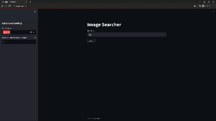

# image-search-app

Search and download images using Streamlit and icrawler.



## Installation

```
git clone https://github.com/tomcat930/image-search-app.git
cd image-search-app
pip install -r requirements.txt
```

## Usage

Launch the app.

```
streamlit run app.py
```

Launch with Docker.

```
docker compose up -d
```